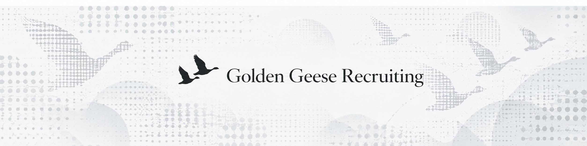

  

  # FDE Recruiting & Advisory

  **Built by operators who've done the work.**

---

## Who We Are

### Paxton Duff
**Co-Founder & CEO**

Employee 25 at Codeium/Windsurf and a top-performing AE. Worked alongside technical teams and customers during the company's rapid growth.

### Maggie Krummel
**Co-Founder & Managing Partner**

Second deployed engineer at Codeium/Windsurf and the first technical hire outside the Bay Area. Went on to build the global deployed engineering team across Austin, London, and LATAM.

### Our Experience

- **1,000+ interviews conducted**
  - Deep experience evaluating technical and customer-facing talent.

- **Dozens of FDEs hired**
  - We know what separates a strong résumé from a great deployed engineer.

- **Built the function firsthand**
  - Real experience designing and scaling deployed engineering teams.

---

## How We Help

We recruit Forward Deployed Engineers for AI companies, and advise early-stage AI startups.

### For Companies

#### FDE Recruiting
**Companies of All Sizes**

Source and vet exceptional FDEs matched to your product and role.

#### Customer Engineering Org Advisory
**Preseed – Series C**

Design the mix of roles you need across the customer lifecycle, and the profiles to hire for each.

### For Engineers

#### Explore FDE Roles

Find FDE roles that align with your strengths and goals, and build the skills to succeed.

---

